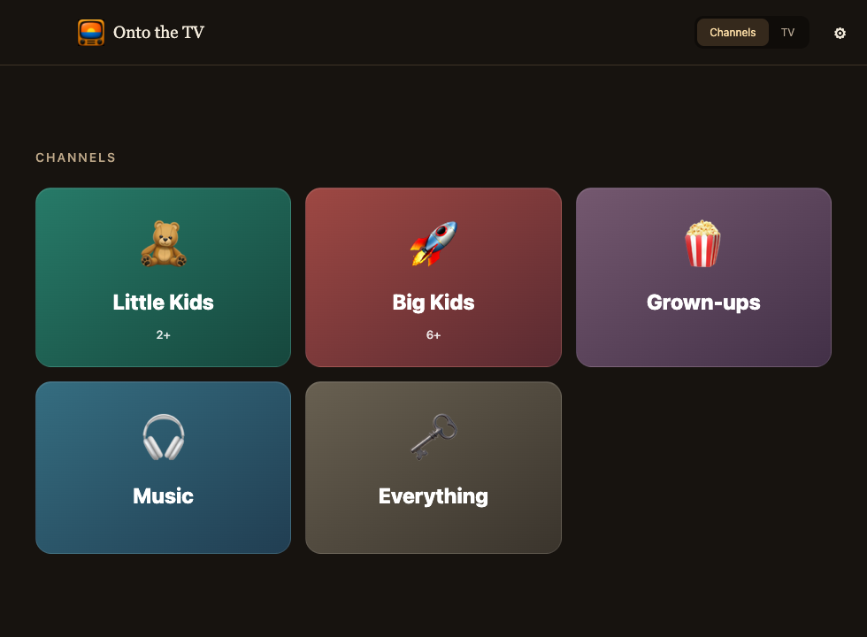

<p align="center"></p>

# Onto the TV

**A few channels, fed by the videos you already have.**

Open the app, choose a channel, and watch. Each channel picks its next episode
from its library, learning from skips and completions and avoiding recent repeats.
Playback is built into the app. Left and right arrows go back and forward;
returning to a skipped episode cancels its penalty.



The TV tab sends selected files to a compatible Samsung DLNA renderer. It does
not yet follow the automatic channel sequence. The Mac must stay awake and on
the same network while serving a TV.

## Install on a Mac

Requires **macOS 13+**, **Node.js 22.12+**, **Python 3.10+**, and **FFmpeg**. Node
is needed to install/develop, but the installed app contains its own Electron
runtime. FFmpeg and Python are still external prerequisites. With Homebrew:

```sh
brew install node python ffmpeg
git clone https://github.com/todd866/onto-the-tv.git
cd onto-the-tv
npm ci
npm run install-app
```

Open **Onto the TV** from `~/Applications` and drag it to the Dock if you like.
The installer downloads Electron on first use, builds a self-contained app,
checks its local signature, and preserves any previous installation as a hidden
backup beside it. It never starts playback. This is a source-built app with an
ad-hoc signature, not an Apple-notarized binary release.

For development, use `npm start`. To stage a build without registering it:

```sh
python3 scripts/install_mac_app.py --output "dist/Onto the TV.app" --no-register
```

## Set up channels

1. Keep one show per folder inside a video library.
2. Copy [shuffler/tiers.example.json](shuffler/tiers.example.json) to a private
   `tiers.json`. Put your show folder names into the appropriate groups.
3. In **Library settings**, choose the folder and show groups,
   then **Refresh**.
4. Choose a channel.

Unassigned shows go only to Everything. Group choices are yours; they are not
verified age ratings, and the stream picker is not a parental lock. Extra
folders and individual films can be included using the optional
[sources example](shuffler/sources.example.json).

Already have a generated library? **Library settings → Channel setup → Import
library…** reads its video list. The app renders its own player; imported HTML
scripts are never executed. Select your original show-group and source
configurations before refreshing. The browser version remains usable separately.

The app's preferences are separate from your browser's. To migrate saved data,
place a JSON object of storage-key/string-value pairs in
`~/Library/Application Support/Onto the TV/player-import.json` before first use.
Only the documented `kidshuffle.*` preference and viewing-log keys are accepted;
existing app values are never overwritten. This file is private and must stay
outside the repository. There is no continuing browser sync.

The [shuffler guide](shuffler/README.md) covers configuration, shortcuts,
learning, browser compatibility, and safe Android copying with VLC playlists.
Phone playback uses VLC; it does not run the browser learner.

## Set up a TV

In **TV → Connection**, enter the TV's IPv4 address from its network
settings. The default control endpoint is
`http://TV_ADDRESS:9197/upnp/control/AVTransport1`. If your Samsung uses a different
UPnP AVTransport endpoint, enter it under advanced settings. You can also choose
the Mac's Wi-Fi address when automatic interface selection picks the wrong one.

This uses Samsung's DLNA/UPnP renderer, not AirPlay, Chromecast, or the YouTube TV
app. It grew from a 2017 Samsung setup; compatibility with other models depends
on their renderer. There is no automatic device discovery yet.

For advanced command-line use, `npm run cast -- --help` exposes the casting
tools. Optional YouTube URL support in that CLI requires `yt-dlp`; the desktop
app works with local files. Supply your own media and permissions to use it.

## Privacy and network access

- Videos stay in your folders. The app has no cloud account or telemetry.
- Channel preferences and up to 3,000 viewing records stay in app local storage.
  The [guide](shuffler/README.md#watching-and-learning) explains exactly what is
  recorded. Clearing app storage removes them.
- TV settings and selected paths live in
  `~/Library/Application Support/Onto the TV/settings.json`, outside the repo.
- During casting, a temporary HTTP server serves only selected files through
  random, unguessable URLs. It is intended for a trusted local network; the TV
  protocol is unencrypted. Stop or quit revokes the URLs.
- Personal configurations, generated players, phone inventories, playlists,
  and media do not belong in a public fork. The provided `.gitignore` excludes
  their default names. Renamed private files must be kept outside the repo too.

No films, shows, music, download lists, or personal viewing data are included.

## Development and tests

```sh
npm test
npm run test:python
```

Tests use simulated TVs and phones, temporary loopback servers, and short silent
clips generated by FFmpeg. They do not contact real hardware. UI smoke testing
can run in headless Chromium with a simulated preload API; no audible or
foreground playback is required.

| Folder | Purpose |
| --- | --- |
| `src/` | Electron shell, private settings, TV queue and embedded channels |
| `ui/` | Offline app interface |
| `casting/` | Media preparation, HTTP serving and Samsung control |
| `shuffler/` | Offline player, generator, Android sync and playlist tools |
| `brand/` | Shared TV icon and macOS icon bundle |

## License and credits

[MIT](LICENSE). The original app icon was generated with OpenAI's image tools
and is included under the same license. Electron and its bundled components
retain their own licenses; the installer carries their notices into the app.
FFmpeg and optional tools are installed separately. Samsung is a trademark of
its owner; this is an independent project.

### Personal audiences and local taste data

Put `{"enabled":true}` in `audiences.json` in the app's user-data directory to replace Grown-ups with **Mum**, **Dad** and **Both**. Existing Grown-ups preferences are retained separately; they are not assigned to either person. On macOS the directory is `~/Library/Application Support/Onto the TV`.

Adult channels offer a timeline, ±10 seconds, and **Later** with saved positions. Left/right moves between episodes; Shift+left/right seeks; L saves for later. Controls fade during playback. Later is neutral. A visit with manual seeking does not teach a preference, since playback position would otherwise mistake seeking for watching. Back still undoes an early skip.

Mum and Dad have independent episode weights and bookmarks. Both uses the harmonic mean of their weights, multiplied by its own learned weight (bounded to 0.15–4). Unknown preferences start at 1; they are not evidence of shared enthusiasm. Joint viewing updates only Both. These are simple local weighted choices, not a trained language model.

The embedded app writes private `taste.json` snapshots and a `library.json` catalogue alongside its settings. Agents can join `profiles.<id>.weights` and `bookmarks` to the catalogue's `src` IDs, titles and show names. Bookmark times are seconds, and `updated` is Unix milliseconds. Weights are per episode; an agent can aggregate by show, but should distinguish actual observations from neutral defaults. The original browser viewing log remains local and is not exported as measured watch time.

These files can inform a later request for viewing suggestions or acquisition from sources you authorize. OtTV does not dispatch agents or download shows automatically. The files and personal audience settings are git-ignored; do not include them in public issues or commits.
